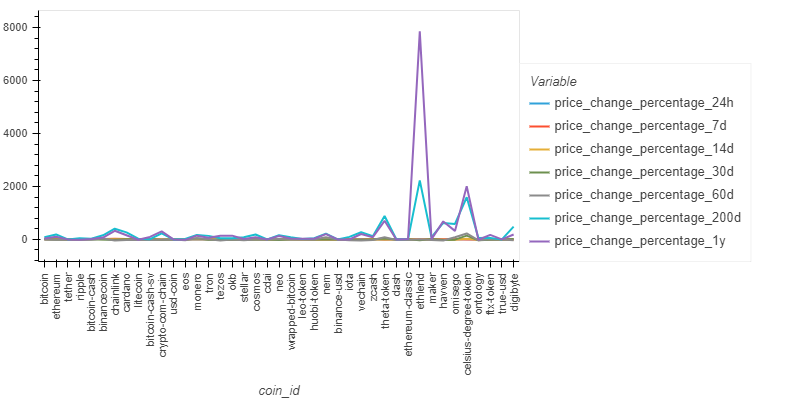
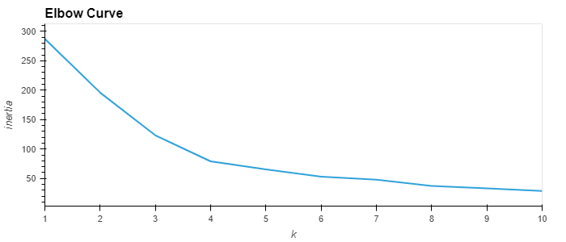
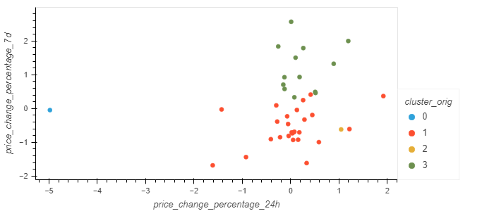
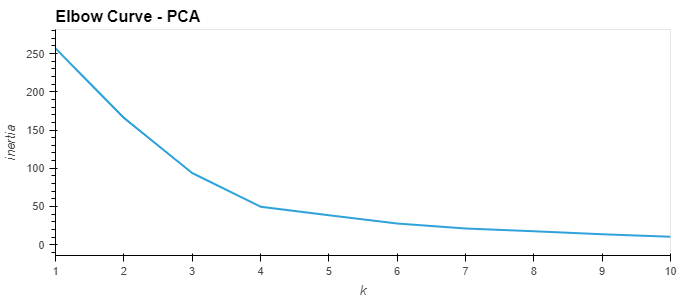
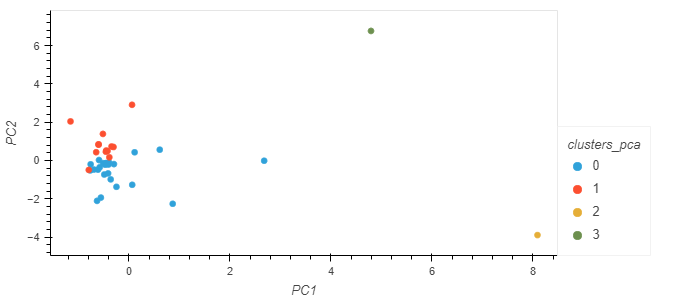

# CryptoClustering
In this challenge, we used an unsupervised learning model to predict the activity of certain cryptocurrencies. We compared the difference in clustering between the original features and primary components (PC) to determine which method yields better results.

## Process
To determine the best methodology for our model, we needed to perform a few steps:

1. We first prepared the data by scaling it using the StandardScaler model.
2. Then, we found the best value for k using the original scaled dataframe.
    * Using KMeans and an elbow curve, we determined that the best value for k was 4.

    
    * We plotted the data to visualize the clusters we just created.

    
3. Next we found the best value for k using a PCA dataset.
    * We transformed the original data into three primary components. With these three components, approximately 89% of the variance is explained.
    * We then used the KMeans model to determine the best value for k.
    * We determined the best value for k was still 4.

    
    * We plotted the data to visualize these clusters.

    
4. We compared the two results to determine which methodology gave us the best clusters.
    * Based on the results, the PCA method gave us 4 clusters with smaller inertia than the original features, meaning the points are overall closer than in the original model. 
    * We were also able to better visualize our data with the PCA model because there were fewer dimensions to display on a plot.

